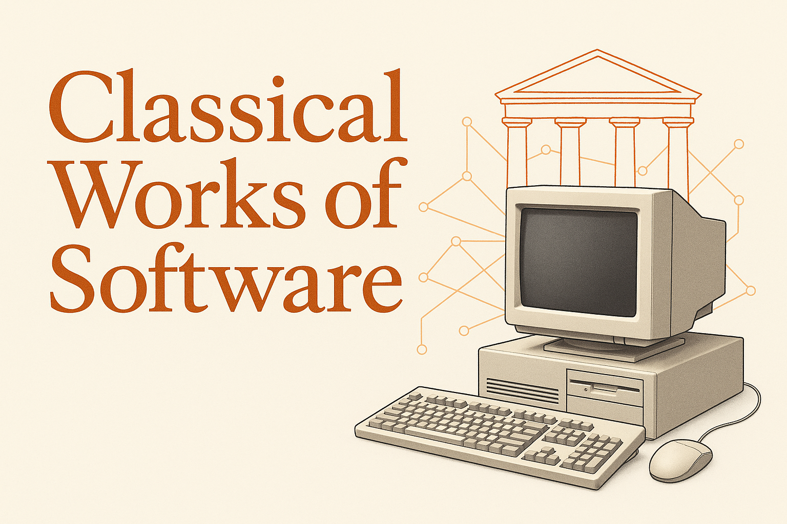

Classical works of software
===========================

I'm studying the birth of **new software ideas**.

Software, as a medium, is a very new artform. But it is an artform. It's a craft. And with any new idea, there is its first form from when it's fleshed out. We have things like the [Magna Carta](https://en.wikipedia.org/wiki/Magna_Carta), which were the first written documents that provided the basis for the contemporary powers of Parliament and legal principles such as habeas corpus. But what about software? What are the foundational ideas that were first expressed through code? 

Well, there are many:

 - GCC
 - PostScript (PDF)
 - Linux
 - The World Wide Web
 - JavaScript
 - SQLite
 - Git
 - WebKit
 - BitTorrent
 - Bitcoin

Maybe a few of these are not foundational - ie. JS. But they had such an impact on the world that it's really interesting to study their first implementations. When the code still sucked - but it was minimal. It was a proof-of-concept. A window into the author's mind. I often find reading this code gives me a better understanding than any of the core problem they were solving.

Most of these works are under 10K lines of code, across 10-100 files. Contrast this with their current implementations which are often 100,000's to millions of lines more today. Reading Linux's original code and stumbling upon `execve`, learning how a process is literally executed, how the `argv` are copied into the process's memory page, how the stack is switched - is so much easier when it is so rudimentary. 